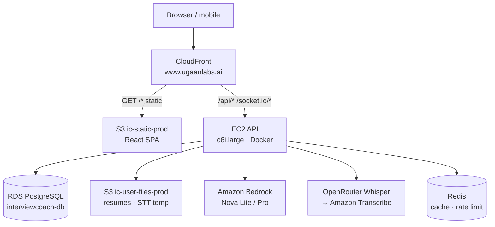
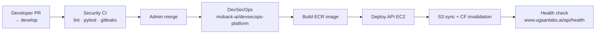

# Architecture — InterviewCoach AI (PROD)

Production URL: **https://www.ugaanlabs.ai** (apex `ugaanlabs.ai` redirects to www)  
Region: **ap-south-1** (Mumbai) · CloudFront ACM cert: **us-east-1**

---

## High-level request flow



| Path | Origin | Notes |
|------|--------|-------|
| `/`, `/login`, SPA routes | S3 via OAC | SPA fallback: 403/404 → `index.html` |
| `/api/*` | EC2 API (HTTP origin) | No cache (managed cache policy) |
| `/functions/*`, `/socket.io/*` | EC2 API | WebSocket / server functions |
| User uploads | API → S3 | Served via `/storage` or signed URLs |

CloudFormation: `infra/prod/cloudformation/prod-cloudfront.yaml`  
Deploy script: `infra/prod/scripts/09-code-cloudfront-deploy.sh`

---

## Application stack

| Layer | Technology | Prod notes |
|-------|------------|------------|
| Frontend | Vite + React 19 | Built with `VITE_API_BASE_URL=https://www.ugaanlabs.ai/api` |
| API | Flask + Gunicorn + Socket.IO | `docker/api/Dockerfile.prod` — no Ollama/Whisper in image |
| Database | PostgreSQL (RDS) | Connection pool via `psycopg2` |
| LLM | Amazon Bedrock | Nova Lite (chat), Nova Pro (reports) — `common/llm/bedrock.py` |
| STT | OpenRouter → Amazon | Chain in `common/speech/factory.py` |
| TTS | Piper (in-container) | Server-side interview voice |
| Storage | S3 | `common/storage_s3.py` — resumes, audio temp (`stt-temp/` 1-day lifecycle) |
| Cache / limits | Redis | Rate limiting, interview slots — `common/redis_store.py` |
| Config | AWS Secrets Manager | Single JSON secret — see [SECRETS_ONLY.md](SECRETS_ONLY.md) |
| Auth | JWT (bcrypt passwords) | 10-minute idle timeout on protected routes |

Local dev still uses Ollama + `.env` (`RUNTIME_CONFIG_ALLOW_ENV=true`).

---

## AWS infrastructure

### CloudFormation stacks

| Stack | Template | Purpose |
|-------|----------|---------|
| `interviewcoach-prod-s3` | `prod-stack.yaml` | Static + user-files buckets (Retain policy) |
| `interviewcoach-prod-cloudfront` | `prod-cloudfront.yaml` | CDN, OAC, `/api/*` routing |

S3 stack rename/import (legacy hybrid stack): `infra/prod/scripts/02b-rename-s3-stack.sh`

### S3 buckets

| Bucket | Use |
|--------|-----|
| `ic-static-prod` | React build artifacts (CloudFront origin) |
| `ic-user-files-prod` | User files, STT temp prefix |
| Legacy `interviewcoach-storage-*` | Migrated via `07b-migrate-legacy-storage.sh` |

### Compute

| Resource | Role |
|----------|------|
| EC2 `c6i.large` | Prod API host — Docker compose from ECR image |
| ECR `interviewcoach-api` | Prod API container |
| ECR `interviewcoach-web` | Optional web image (static deploy uses S3 sync) |

Infra names and IDs: `infra/prod/prod.env` (no secrets — safe to commit).

### DNS & TLS

1. ACM certificate in **us-east-1** for `ugaanlabs.ai` + `www.ugaanlabs.ai` (canonical: **www**)
2. CloudFront distribution with custom aliases
3. Namecheap DNS: `@` ALIAS + `www` CNAME → CloudFront domain

Scripts: `09-code-cloudfront-deploy.sh`, `09a-acm-validation-dns.sh`, `09b-namecheap-dns-cutover.sh`, `09-code-cutover.sh`

---

## Configuration model (secrets-only)

Prod API containers receive **only**:

```yaml
AWS_REGION: ap-south-1
AWS_SECRETS_MANAGER_SECRET_ID: interviewcoach/prod/app
```

All other settings (`DB_*`, `JWT_SECRET`, `OPENROUTER_API_KEY`, `LLM_PROVIDER`, etc.) live in the Secrets Manager JSON.

- Template: `backend/secrets.prod.example.json`
- Loader: `backend/common/runtime_config.py`
- Validation: `backend/common/secrets_schema.py` at startup

---

## Deploy & release flow



Developers **do not** deploy from this repo. See [DEVSECOPS.md](DEVSECOPS.md) and [DEPLOY.md](DEPLOY.md).

Workflow template (copy to devsecops-platform): `infra/prod/github-workflows/deploy-prod.yml`

---

## Migration from Plan B (legacy)

Previous architecture: dedicated AI EC2 (Ollama + Whisper sidecar), nginx frontend EC2, local `/apps/storage`.

| Legacy | PROD replacement |
|--------|------------------|
| Ollama LLM | Amazon Bedrock |
| Whisper sidecar | OpenRouter + Amazon Transcribe |
| nginx frontend EC2 | S3 + CloudFront |
| Local disk storage | S3 `ic-user-files-prod` |
| `.env` on server | Secrets Manager JSON |

Runbook: [PROD_RUNBOOK.md](PROD_RUNBOOK.md) · Decommission: [AWS_DECOMMISSION.md](AWS_DECOMMISSION.md)

---

## Repository layout

```
backend/              Flask API, common/ providers (llm, speech, storage)
frontend/             Vite + React SPA
database/             Schema and SQL migrations
docker/               Dockerfile.prod, compose files
infra/prod/           CloudFormation, IAM, deploy scripts, prod.env
docs/                 Runbooks, architecture, security
scripts/              Local dev and maintenance helpers
```

---

## Health check

After deploy or cutover:

```bash
curl -fsS https://www.ugaanlabs.ai/api/health | jq .
```

Expected on prod: `llm.provider=bedrock`, STT chain includes configured providers, `config.source=secrets_manager`.
