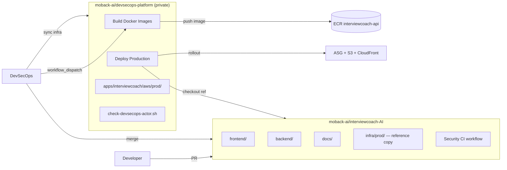
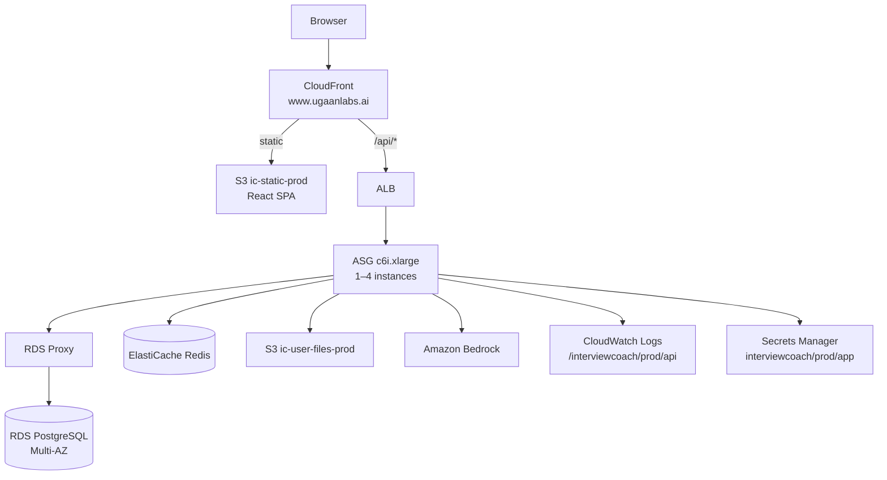
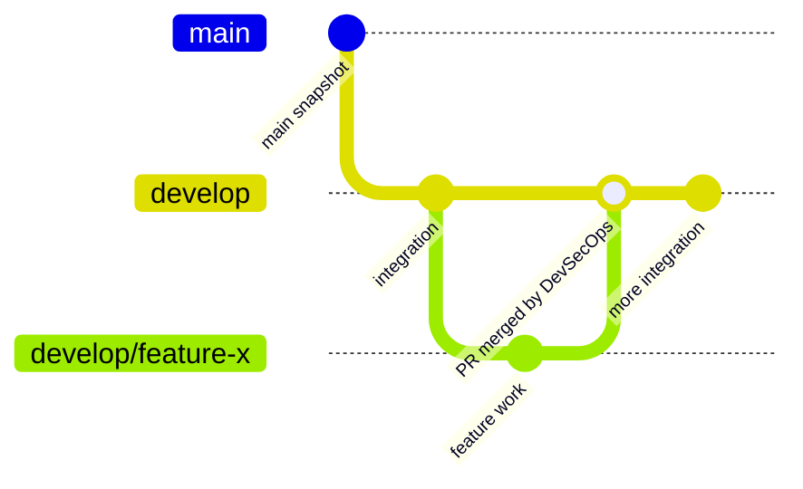
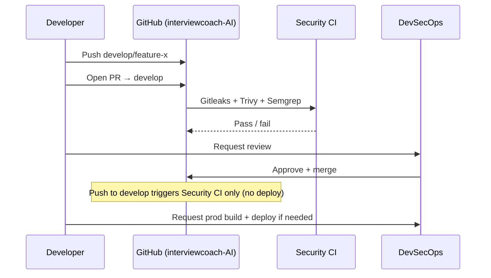
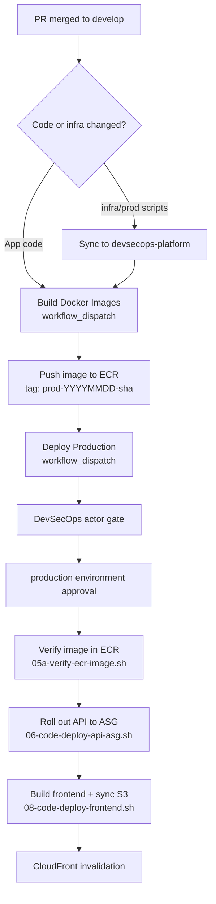

# DevSecOps guide — InterviewCoach

Complete reference for **roles**, **architecture**, **CI/CD**, **security scanning**, and **production release** for InterviewCoach.

**Production URL:** https://www.ugaanlabs.ai  
**Region:** `ap-south-1` (Mumbai)

Quick links: [DEVSECOPS.md](DEVSECOPS.md) (cheat sheet) · [DEPLOY.md](DEPLOY.md) · [ARCHITECTURE.md](ARCHITECTURE.md) · [SECURITY_SCANNING.md](SECURITY_SCANNING.md) · [DEV_ACCESS.md](DEV_ACCESS.md)

---

## 1. Roles and responsibilities

| Role | People | GitHub | AWS IAM group | Can merge PRs? | Can deploy prod? |
|------|--------|--------|---------------|----------------|----------------|
| **DevSecOps** | Govardhan, Kishore | `@govardhanreddy66`, `@KFKishore23` | `InterviewCoach-DevSecOps` | **Yes** (`develop`, `main`) | **Yes** (via `devsecops-platform`) |
| **Developer** | ganesh, neeraj | (org members) | `InterviewCoach-Developers` | **No** — open PRs only | **No** |
| **Everyone else** | — | — | — | No | No |

### DevSecOps responsibilities

- Approve and merge pull requests to `develop` and `main`
- Run Security CI review expectations before merge
- Sync `infra/prod/` to `moback-ai/devsecops-platform` when infra scripts change
- Build Docker images and deploy production (build-once → rollout-only)
- Manage GitHub `production` environment reviewers and AWS IAM policies
- Incident response, prod runbooks, CloudWatch alarms

### Developer responsibilities

- Work on `develop/<feature>` branches
- Open PRs into `develop`; ensure **Security** CI passes
- Request DevSecOps review and merge
- Read production logs via **CloudWatch only** (no in-app log UI)
- **Do not** run `infra/prod/scripts/*` from the application repo

### Developer AWS access (read-only logs)

| Allowed | Blocked |
|---------|---------|
| CloudWatch Logs read on `/interviewcoach/prod/api` | Secrets Manager (`interviewcoach/*`) |
| Logs Insights queries | EC2, RDS, S3, IAM, CloudFormation, deploy, SSH |
| Change own IAM console password | Bedrock admin, ECR push, etc. |

Policies: `InterviewCoach-Developer-Logs-ReadOnly` + `InterviewCoach-Developer-Deny`  
Details: [DEV_ACCESS.md](DEV_ACCESS.md)

---

## 2. Repository split

Production operations are **intentionally split** across two GitHub repositories:



| Repository | Purpose |
|------------|---------|
| **interviewcoach-AI** | Application code, docs, Security CI, no prod deploy |
| **devsecops-platform** | Production build + deploy workflows, AWS credentials, actor gate |

**Rule:** `infra/prod/scripts/*` call `require-devsecops.sh` and **exit** when run from the application repo.

---

## 3. Production architecture



| Path | Origin |
|------|--------|
| `/`, `/login`, SPA routes | S3 → CloudFront (OAC) |
| `/api/*` | ALB → ASG (nginx → Gunicorn :5000) |
| `/socket.io/*` | EC2 API (WebSocket) |

Full topology: [ARCHITECTURE.md](ARCHITECTURE.md)

### Service hours (IST)

| Window | API ASG | User-facing banner |
|--------|---------|-------------------|
| **10:00 – 19:00** | Min **1**, max **4** (CPU autoscale) | Hidden — app live |
| **19:00 – 10:00** | **0** instances (cost saving) | **Maintenance banner** (auto via `/api/service-hours`) |

- Banner polls every **60 seconds** and hides automatically when service opens.
- Config: `SERVICE_HOURS_START`, `SERVICE_HOURS_END`, `SERVICE_HOURS_TZ` on API.
- CPU autoscale: **> 70%** ~10 min → scale out; **< 30%** → scale in (not below min 1 during hours).

---

## 4. Branch policy and PR workflow



| Branch | Purpose | Who merges |
|--------|---------|------------|
| `develop/<feature>` | Feature work | — (PR source) |
| `develop` | Integration / deploy source | **DevSecOps only** |
| `main` | Production mirror / monthly sync | **DevSecOps only** from `develop` |

Enforcement:

- `.github/CODEOWNERS` — all files require `@govardhanreddy66` + `@KFKishore23` review
- Branch protection on `develop` and `main`
- Developers **open** PRs; they **do not** merge

### Developer release flow (step-by-step)



1. Create branch `develop/<feature>` from `develop`
2. Open PR into `develop`
3. Wait for **Security** workflow (Gitleaks, Trivy, Semgrep) — all must pass
4. Request DevSecOps review
5. DevSecOps approves and merges
6. Ask DevSecOps for production build/deploy when ready

Details: [DEPLOY.md](DEPLOY.md) · [.github/BRANCH_POLICY.md](../.github/BRANCH_POLICY.md)

---

## 5. Security CI (application repo)

**Workflow:** `.github/workflows/code-quality-security.yml`  
**Triggers:** PR to `main` / `develop`; push to `develop`; weekly schedule; manual

| Job | Tool | What it checks |
|-----|------|----------------|
| **Gitleaks** | Gitleaks v8 | Secrets in git history (`.gitleaks.toml`) |
| **Trivy** | Trivy v0.70 | Filesystem CVEs — CRITICAL/HIGH (`.trivyignore`) |
| **Semgrep** | Semgrep `p/ci` | SAST — Python, JS, GitHub Actions, Dependabot config |

**Removed** (cost/complexity): CodeQL, Bandit, pip-audit, Veracode, duplicate Security workflow.

### Local scan

```bash
bash scripts/security-scan-all.sh
```

Details: [SECURITY_SCANNING.md](SECURITY_SCANNING.md)

### Supply-chain controls

- GitHub Actions pinned to **full commit SHAs** (Semgrep rule)
- Dependabot **cooldown** periods on version updates (`.github/dependabot.yml`)
- `open-pull-requests-limit: 0` — security updates batched by DevSecOps

---

## 6. Production deploy pipeline (DevSecOps only)



### Build once (when application code changed)

**Repo:** `moback-ai/devsecops-platform`  
**Workflow:** **InterviewCoach · Build Docker Images**

| Input | Example |
|-------|---------|
| `app_git_ref` | `develop` or merge SHA |
| `image_tag` | `prod-20260701-abc1234` |

### Deploy rollout only (no Docker build)

**Workflow:** **InterviewCoach · Deploy Production**  
Template: `infra/prod/github-workflows/deploy-prod.yml` (copy lives in devsecops-platform)

| Input | Notes |
|-------|-------|
| `app_git_ref` | Same ref as build |
| `image_tag` | **Must exist in ECR** from build step |
| `deploy_api` | Roll ASG to new image |
| `deploy_frontend` | Build Vite + sync `ic-static-prod` |

### Safety controls

| Control | Script / config | What it does |
|---------|-----------------|--------------|
| Actor gate | `check-devsecops-actor.sh` | Only `@govardhanreddy66`, `@KFKishore23` |
| Repo gate | `require-devsecops.sh` | Blocks prod scripts from application repo |
| ECR verify | `05a-verify-ecr-image.sh` | Deploy fails if tag missing |
| GitHub environment | `production` on devsecops-platform | Optional second approval (Team/Enterprise) |
| Quality gate | `pre-deploy-quality-gate` action | Lint, build, pytest, merge conflict check |
| Retired workflows | `deploy.yml`, `auto-deploy-develop.yml` | Explicitly fail — no deploy from app repo |
| CODEOWNERS | `.github/CODEOWNERS` | DevSecOps required on all PRs |

---

## 7. DevSecOps playbook (step-by-step)

### A. Merge a developer PR

1. Verify **Security** CI green on the PR
2. Review code + infra impact
3. Approve and **merge** to `develop` (squash or merge per team preference)
4. Confirm post-merge Security CI on `develop` passes

### B. Release to production

1. **Sync infra** (if `infra/prod/` changed):
   ```bash
   bash scripts/sync-interviewcoach-prod.sh
   ```
2. **Build** — devsecops-platform → **InterviewCoach · Build Docker Images**
   - Note `image_tag` (e.g. `prod-20260701-a1b2c3d`)
3. **Deploy** — **InterviewCoach · Deploy Production**
   - Same `app_git_ref` and `image_tag`
   - Enable `deploy_api` / `deploy_frontend` as needed
4. **Smoke test** — https://www.ugaanlabs.ai/api/health, login, upload flow
5. **Watch CloudWatch** — `/interviewcoach/prod/api` for errors

### C. Monthly `develop` → `main` sync

- Scheduled: maintenance workflow (`maintenance-scheduled.yml`) 1st of month
- Or manual: workflow_dispatch → `sync-main`
- DevSecOps merges `develop` into `main` (mirror only — **prod deploys from `develop`**)

### D. One-time / rare setup

```bash
# GitHub secrets (devsecops-platform)
ALLOW_LOCAL_PROD_DEPLOY=1 bash infra/prod/scripts/16-set-github-prod-secrets.sh

# GitHub production environment reviewers
ALLOW_LOCAL_PROD_DEPLOY=1 bash infra/prod/scripts/16b-set-github-prod-environment.sh

# AWS IAM policies
# devsecops-platform/scripts/apply-iam-policies.sh --apply
```

---

## 8. Application repo workflows

| Workflow | File | Trigger | Purpose |
|----------|------|---------|---------|
| **Security** | `code-quality-security.yml` | PR / push `develop` | Gitleaks, Trivy, Semgrep |
| **Maintenance · Scheduled** | `maintenance-scheduled.yml` | Cron / manual | Log prune, branch cleanup, develop→main |
| **Deploy · Auto (develop)** | `auto-deploy-develop.yml` | Push `develop` | **No-op notice** — no deploy |
| **Deploy · Production (retired)** | `deploy.yml` | Manual | **Fails** — redirects to devsecops-platform |

Details: [.github/workflows/README.md](../.github/workflows/README.md)

---

## 9. IAM and secrets (summary)

| Resource | ID / name |
|----------|-----------|
| App secret | `interviewcoach/prod/app` (Secrets Manager JSON) |
| API logs | CloudWatch `/interviewcoach/prod/api` |
| ECR repo | `interviewcoach-api` |
| Static bucket | `ic-static-prod` |
| User files | `ic-user-files-prod` |

**Developers:** `InterviewCoach-Developer-Logs-ReadOnly` + deny policies  
**DevSecOps:** full prod deploy + infra access via `InterviewCoach-DevSecOps`

Secrets reference: [SECRETS_ONLY.md](SECRETS_ONLY.md)  
Prod runbook: [PROD_RUNBOOK.md](PROD_RUNBOOK.md)

---

## 10. Troubleshooting

| Symptom | Likely cause | Action |
|---------|--------------|--------|
| Security CI Semgrep fail | Mutable action tags, test secrets, Dependabot config | Pin SHAs; use `test_constants.py`; add cooldown |
| Deploy denied | Non-DevSecOps actor | Run from devsecops-platform as Govardhan/Kishore |
| ECR verify fail | Wrong `image_tag` | Re-run Build workflow first |
| No API logs for devs | Outside 10:00–19:00 IST | ASG scaled to 0 — expected |
| Maintenance banner stuck | API unreachable | Check ASG schedule; banner uses fallback when `/api/service-hours` fails |
| `require-devsecops.sh` error | Script run from app repo | Use devsecops-platform Actions |

---

## 11. Document index

| Document | Contents |
|----------|----------|
| [DEVSECOPS.md](DEVSECOPS.md) | Short cheat sheet |
| [DEVSECOPS_GUIDE.md](DEVSECOPS_GUIDE.md) | This guide |
| [DEPLOY.md](DEPLOY.md) | Developer + deploy summary |
| [ARCHITECTURE.md](ARCHITECTURE.md) | AWS topology, stacks, DNS |
| [SECURITY_SCANNING.md](SECURITY_SCANNING.md) | Scanner details |
| [DEV_ACCESS.md](DEV_ACCESS.md) | Developer CloudWatch access |
| [PROD_RUNBOOK.md](PROD_RUNBOOK.md) | Infra bootstrap phases |
| [BRANCH_POLICY.md](../.github/BRANCH_POLICY.md) | Branch rules |
| [SECURITY.md](../SECURITY.md) | Vulnerability reporting |

---

*Last updated: 2026-07-01 — aligns with Security CI (Gitleaks, Trivy, Semgrep), devsecops-platform deploy, and service-hours maintenance banner.*
