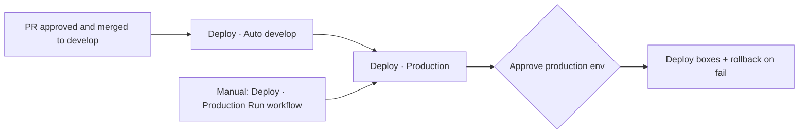

# Product requirements (from team setup)

This document captures what was requested across prior setup sessions, and what is implemented on `develop`.

## 1. Repository & local dev

| Requirement | Status |
|-------------|--------|
| Clone `moback-ai/interviewcoach-AI` and keep project active | Done |
| Move SSH keys off Desktop to `~/.ssh` (mode 600) | Done |
| Local dev: frontend + backend + DB tunnel | `scripts/dev-local.sh`, `scripts/dev-start.sh` |

## 2. Branching & Git

| Requirement | Status |
|-------------|--------|
| **`develop`** is primary integration (same starting code as `main`) | Done — default branch |
| Feature work on **`develop/<feature>`** (e.g. `develop/feat-login`) | Done |
| **`main`** updated from `develop` **monthly** only (not daily) | `Maintenance · Scheduled` → `sync-main` |
| **Do not** auto-merge feature branches into `develop` | Done — admin merge only |
| Merge to `develop` **only after successful production deploy** | Done — `deploy-verified` label / policy |
| **Do not merge Ganesh PR #18** (token work) | Closed — use `develop` session handling |
| **One release PR** (`develop` → `main`), not many Dependabot PRs | PR #72 merged; Dependabot limit 0 |

## 3. Deploy & production

| Requirement | Status |
|-------------|--------|
| Deploy **only from `develop` / `develop/*`** — never `main` | Done |
| **Admin PR approval** before any deploy dispatch | `Deploy · Auto (develop)` |
| **Production environment approval** (second admin) | `Deploy · Production` |
| Failed deploy **rolls back** to last stable — failed code never stays live | `deploy.yml` rollback jobs |
| **Auto deploy** after approved merge to `develop` | `Deploy · Auto (develop)` on push |
| **Manual deploy** when auto did not run or re-deploy same SHA | `Deploy · Production` → **Run workflow** |
| Simple deploy documentation (not long checklists) | [DEPLOY.md](DEPLOY.md) |
| Workflows named consistently | [.github/workflows/README.md](../.github/workflows/README.md) |

## 4. Server performance & cleanup

| Requirement | Status |
|-------------|--------|
| Free RAM / reduce idle load on API host | Lazy imports, `ENABLE_AI_WARMUP=false`, deploy cleanup |
| Keep **last 2 successful releases**; archive/delete older | `scripts/cleanup-host-artifacts.sh` |
| Dated archive folders (`DD_MM_YYYY`) | In cleanup script |
| Log rotation / pruning | `scripts/log-maintenance.sh` + scheduled workflow |
| App fast and stable — **no features removed** | Performance commit on `develop`; Vite chunk fix for login |
| Weekly/monthly maintenance automated | `Maintenance · Scheduled` |

## 5. Security

| Requirement | Status |
|-------------|--------|
| CI security scans on every PR | **Security** workflow (CodeQL, Trivy, Semgrep, Gitleaks, audits) |
| Optional Veracode | **Security · Veracode (manual)** |
| Playwright smoke: login page loads | `frontend/e2e/login.spec.js` |
| Login bundle must not break after chunk splits | `scripts/verify-frontend-login-bundle.sh` |

## 6. Auth & UX

| Requirement | Status |
|-------------|--------|
| **10-minute idle** auto sign-out if user forgets logout | `useIdleTimeout(10)` in `AuthenticatedShell` |
| 30-second warning before logout | `IdleTimeoutModal` |
| Pause idle timer during uploads / long operations | `OperationContext` |
| Interview page: idle timeout **enabled** (was disabled) | Done — 10 min on all protected routes |
| Login/password page works after deploy | Vite `manualChunks` removed; bundle guard in CI |
| Session expired redirect on logout | `logout({ expired: true })` |

## 7. Code quality (ongoing)

| Requirement | Status |
|-------------|--------|
| Root README for onboarding | `README.md` (local) |
| Backend unit tests (auth, document validation) | `backend/tests/` (local, CI step added) |
| Replace `alert()` with in-app modals | Dashboard done; Question/Upload/History partial |
| Split large `app.py` into blueprints | Not started (large refactor) |

---

## Deploy flow (how it actually works)

**Manual button is required only as a fallback** — not for every release.

See [DEPLOY.md](DEPLOY.md) for the short checklist.
